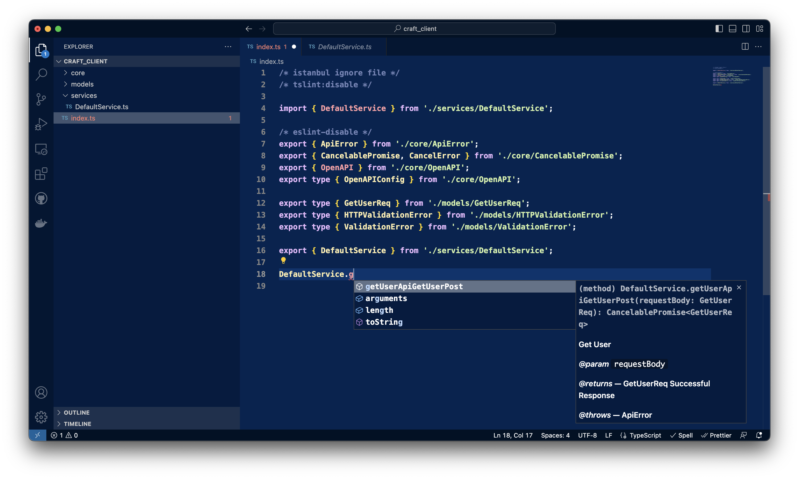

# Craft

Why are we writing controllers in 2023?

## Server

```python
from pydantic import BaseModel

from lib import expose, run_server


class GetUserReq(BaseModel):
    count: int


@expose
def get_user(
        ctx: GetUserReq
) -> GetUserReq:
    # auth?
    return ctx


if __name__ == '__main__':
    run_server()

```

generate fully typed client with 
```shell
openapi --input http://0.0.0.0:8000/openapi.json --client axios -o craft_client
```



## TODO

- [ ] Errors
- [ ] Authentication & Authorization
